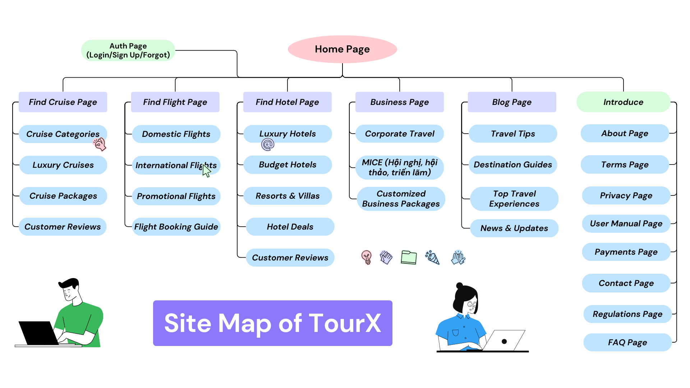
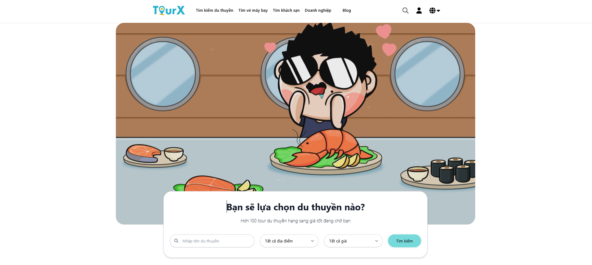
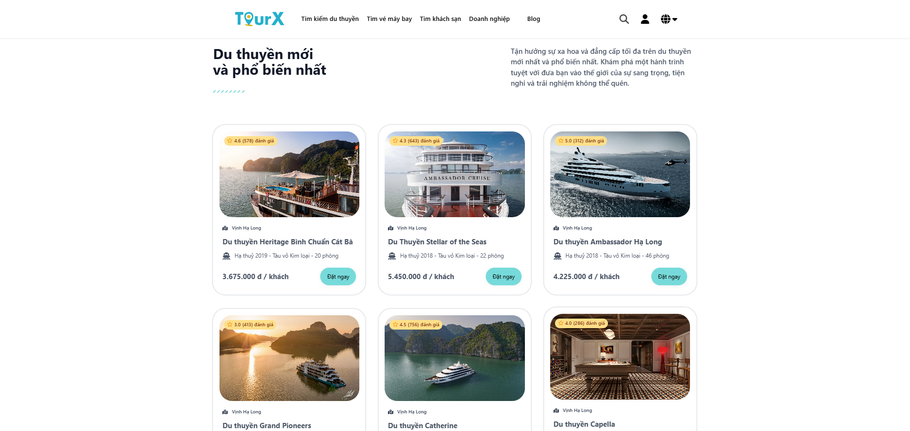
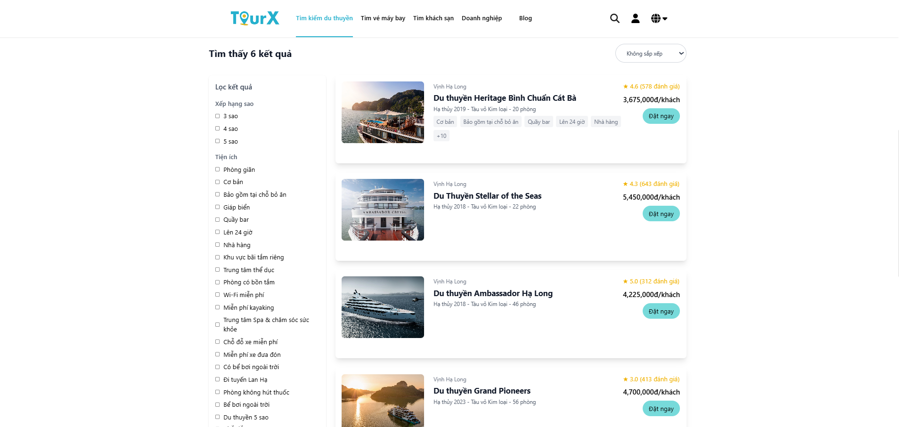
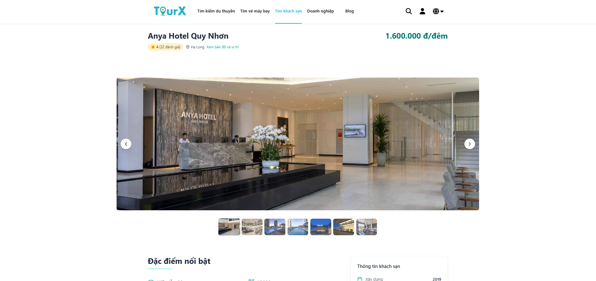

# Team #11
## Subject: Application Interface Development
```
DHKTPM18B - 420301541302
Instructor: Từ Thị Xuân Hiền
```
## MERN Project: Building a Tour Booking Website
### (Timeline: 08/02/2025 - 22/03/2025)
## 🤝 Team Members
- `Nguyễn Văn Minh` - `22003405` - STT 53 (`Project Manager`)
- `Bùi Quang Minh` - `22664411` - STT 51
- `Nguyễn Tấn Minh` - `22001075` - STT 52
- `Trần Công Minh` - `22638121` - STT 54
- `Trần Vũ Uyên My` - `22002045` - STT 55

  **[Class List DHKTPM18B](https://docs.google.com/spreadsheets/d/1gaygAMW25scOlaIoXddVJZmmhO2n-DJ-/edit?usp=sharing&ouid=101662654548516828365&rtpof=true&sd=true)**

### Sitemap

### Home Page

### Cruise Booking Page

### Cruise Filter Page 

### Hotel booking Page 


## 🌟 Introduction to TourX
TourX is a platform that helps users easily search, book, and manage their tours conveniently. With an intuitive interface, smooth experience, and detailed information about destinations, TourX brings you the best journeys.
 
```sh  
git clone https://github.com/nvminh162/tourx-app.git  
```
```sh  
cd tourx-app 
```

## 🤝 Contributions
All contributions are welcome! To simplify, only use the `main` branch so that members with no experience with `git` can still work. Please check carefully before pushing commits to avoid unnecessary mistakes. Thank you!

## 📝 Team  
The project is built and developed by team 11 - (2025-2026) - IUH.

## Source Reference:
Get ideas from [Mixivivu](https://mixivivu.com/) for reference purposes only and not for business purposes.

📢 *If you like this project, please ⭐ on GitHub!*